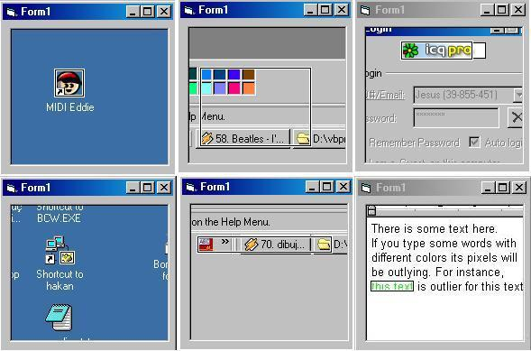



## Outlying Pixels II

### Description

This program gets mouses coordinates and captures screen.

Then calculates main statistics (mean and variance) from captured screen

and defines a volume of area as an outlier pixels set where pixel color values

exceed a critical value.

Finally calculates minimum volume rectangle and shows outlying area

Note: For more robust outlying applications use median instead of mean.

For basic operation of this small algorithm look "Outlying Pixels" in Source

code planet web site.

enjoy.
 
### More Info
 

             |
---                |---
**Submitted On**   |2004-08-07 12:42:34
**By**             |[jbytecode](https://github.com/Planet-Source-Code/PSCIndex/blob/master/ByAuthor/jbytecode.md)
**Level**          |Advanced
**User Rating**    |5.0 (10 globes from 2 users)
**Compatibility**  |VB 5\.0, VB 6\.0
**Category**       |[Graphics](https://github.com/Planet-Source-Code/PSCIndex/blob/master/ByCategory/graphics__1-46.md)
**World**          |[Visual Basic](https://github.com/Planet-Source-Code/PSCIndex/blob/master/ByWorld/visual-basic.md)
**Archive File**   |[Outlying\_P177925872004\.zip](https://github.com/Planet-Source-Code/jbytecode-outlying-pixels-ii__1-55426/archive/master.zip)

